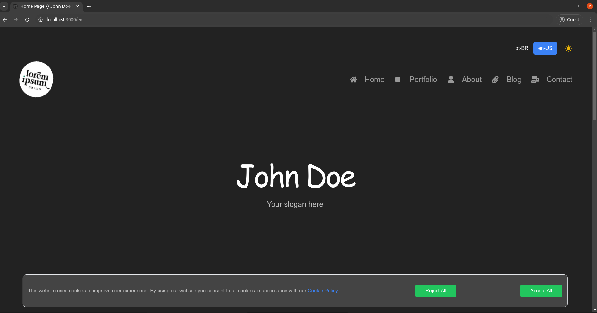
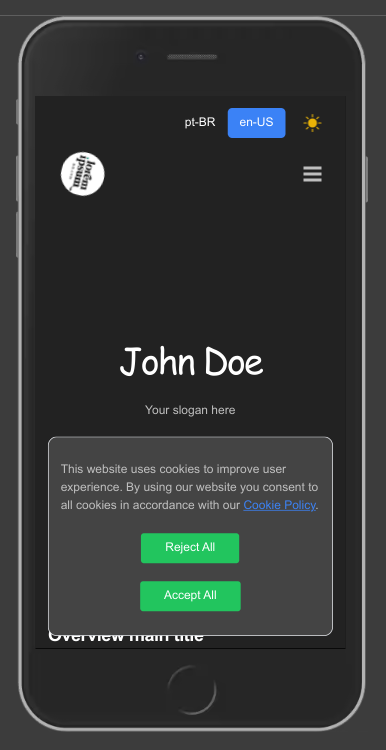

## Getting Started

First, run the development server:

```bash
npm run dev
# or
yarn dev
# or
pnpm dev
# or
bun dev
```

## Overview

| Desktop | Mobile |
|-|-|
|  |  |


Open [http://localhost:3000](http://localhost:3000) with your browser to see the result.

## Alterando informações

Altere o arquivo `src/utils/info.tsx` com suas configurações pessoais.

## Theme
Altere o aquivo `./tailwind.config.ts` para alterar a fonte e as cores do tema

